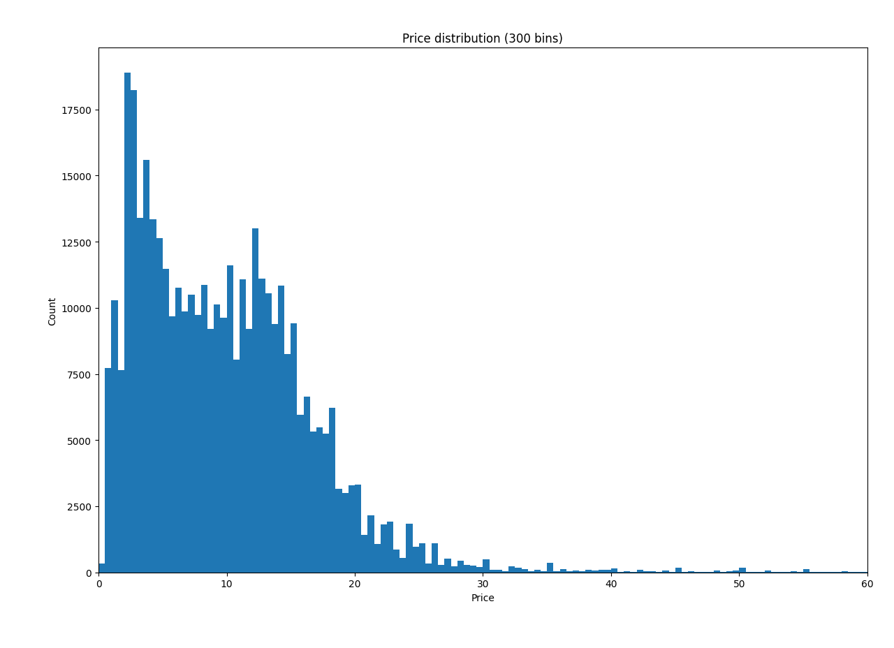
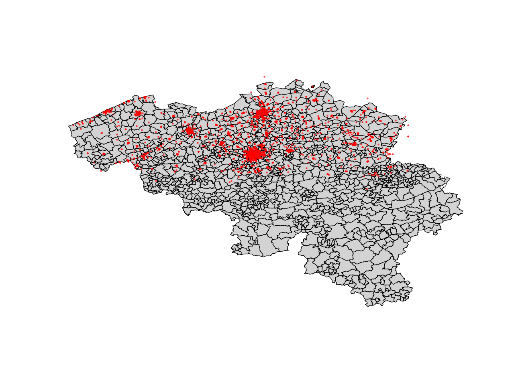

# Conclusions

### 1. What is the price distribution of menu items?

We can see the price distibution on the chart:

**Summary statistic of prices:**

Mean: 9.97 Euro
Median: 9.0 Euro
Minimum: 0.0
Minimum (non-zero): 0.01 (one cent!)
Maximum: 150 Euro
Mode (peak value): 12

### 2. What is the distribution of restaurants per location?

We can see the distribution on the map:

All points are located in Flanders — this is a limitation of the dataset.

The highest concentration of restaurants is found in major cities (Brussels, Antwerp, and Ghent), along major roads, and along the coast.

Some restaurants are located outside Belgium — most likely because cross-border delivery operates in small towns near the border.

### 3. Which are the top 10 pizza restaurants by rating?

| Name                       | Address                  | City              |
|----------------------------|--------------------------|-------------------|
| Kebap - Pizza De Brug      | Sint-Truidersteenweg 46  | Hasselt           |
| De Echte Eethuis Carlos    | Herseltsesteenweg 207    | Aarschot          |
| Trend Kebab & Pizzeria     | Marktstraat 1            | Maaseik           |
| The Black Horse            | Bergstraat 36            | Heist-op-den-Berg |
| Pyramide                   | Stationsstraat 61        | Hamont            |
| Baskent Meerhout           | Bevrijdingslaan 231a     | Meerhout          |
| More pizza's               | De Biezen 26             | Merksem           |
| Pizzeria Zirar Saint-Denis | Chaussee de Bruxelles 10 | Forest            |
| Domino's Pizza             | Markt 77                 | Geel              |
| Pizzeria 1357              | Rue des Juifs 2          | Helecine          |

***My rating is slightly different from other people’s results because I excluded restaurants with high ratings but fewer than 10 reviews.***

### 4. Get the addresses of restaurants that offer sushi and are located near me.

I found only 8 restaurants located near my home (within 1 km). Below are their addresses, sorted by distance from my home in descending order. The average order price for each restaurant is included in the results.

| Name                     | Address                                   |   Avg. price, Euro |   Distance, km |
|--------------------------|-------------------------------------------|--------------------|----------------|
| Oumi Sushi               | Woodrow Wilsonplein (Shopping Zuid) 4/101 |                 13 |           0.08 |
| Asian King               | Nederkouter 135                           |                 11 |           0.56 |
| Yokoso                   | Voldersstraat 17A                         |                 20 |           0.7  |
| Asian Corner Takeaway    | Sint-Niklaasstraat 32                     |                 10 |           0.75 |
| Tokyo Sushi              | Botermarkt 10                             |                 14 |           0.76 |
| Ocean Sushi              | Belfortstraat 31                          |                 11 |           0.87 |
| Japans Restaurant Amatsu | Hoogpoort 29                              |                 38 |           0.91 |
| Twilightsushi            | Korenmarkt 36                             |                 13 |           0.99 |

### 5. Which restaurants in Flanders have the best price-to-rating ratio?

The best restaurant which have the best price-to-rating ratio:
 
Restaurant: 'El Bocadillos' 
Address: Galerie Ravenstein 11, Bruxelles
Euro per rating's star: 0.47

